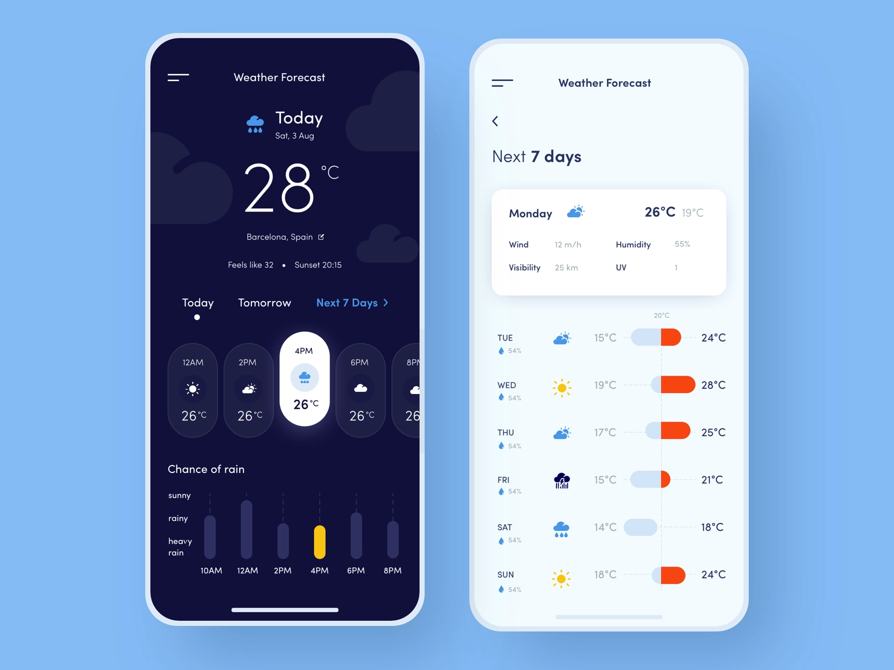

# Bennu Weather Forecast

Please design and implement a functional weather web application that precisely aligns with the attached user interface specifications.

**Design**

- The app is **NOT** responsive and it must match the iPhone 14 Pro UI design above.
- The app only supports portrait mode
- Use the following [font](https://fonts.google.com/specimen/Poiret+One)
- The colors codes can we seen [here](https://aco-viewer.appspot.com/7f9aa74b162cd526c376665961e4bc29). You can also use the attached aco file.
- Use [Weather icons](https://erikflowers.github.io/weather-icons/)
- Use [Bootstrap Icons](https://icons.getbootstrap.com/) for all other icons

**Functionality**

- The app menu is not functional but it must be represented in the implemented UI.
- When the app starts it displays the user's location current weather.
- The Dark Mode functionality must be programmed to adapt according to the user's local sunrise and sunset hours
- Today's and Tomorrow's weather are visible on the same page.
- Next 7 days weather is visible on another page.

**Technical**

- Use HTML5, CSS with any framework or any flavours of Javascript
- Use [Tomorrow.io](https://docs.tomorrow.io/reference/welcome) to obtain the weather data

**Submissions**

- Your submission will initially be assessed by a non-technical reviewer. To facilitate this process, please include a comprehensible README file that outlines the necessary steps to run your application."

- Submit your solution on your personal git account and send the submisson git repo url to `careers@bennu.tech`. with your CV.

Every question is important, so please do not hesitate to inquire. We will swiftly respond to all queries sent to our email, `careers@bennu.tech`, using the subject line Bennu Weather App Question."

Dear Awi Essohanam,

Please use be

​--
The Bennu Bot